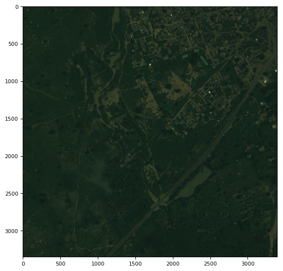
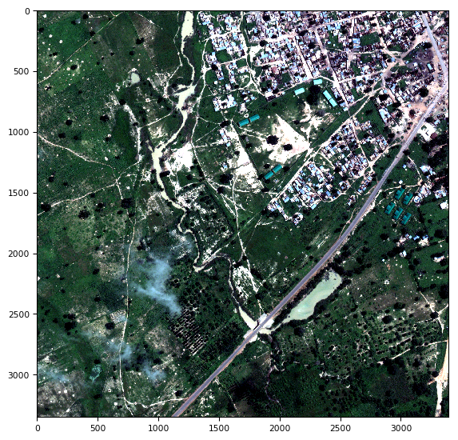
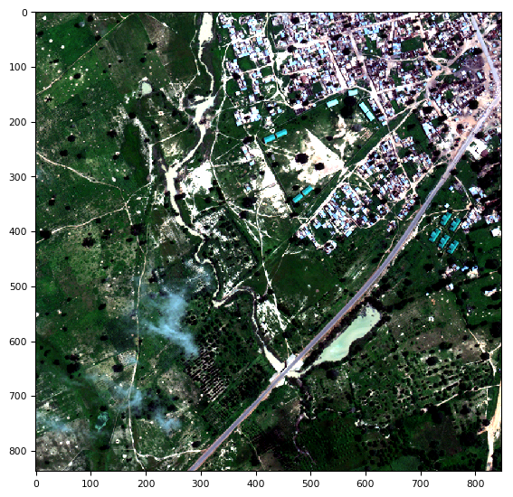
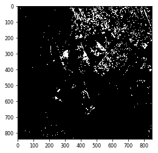
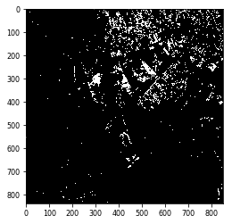
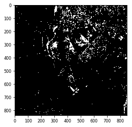
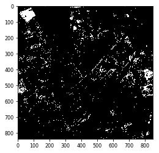
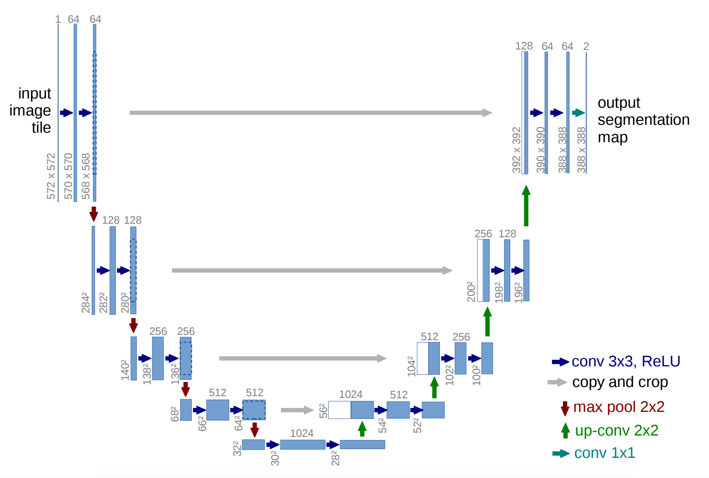
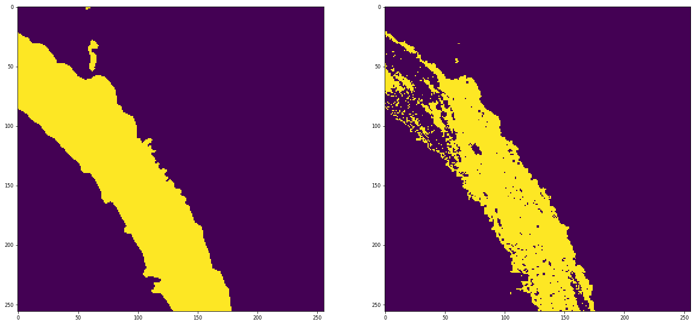

# DSTL Satellite Imagery Feature Detection

[Dstl Satellite Imagery Feature Detection](https://www.kaggle.com/c/dstl-satellite-imagery-feature-detection)

## Data Preparation

[dstl-satellite-imagery-feature-detection/data](https://www.kaggle.com/c/dstl-satellite-imagery-feature-detection/data)有对于数据的详细解释。

从`grid_sizes.csv`读取image scaling信息；从`train_wkt_v4.csv`读取polygens信息，并通过官方推荐的shapely.wtk lib加载

## Visualization

### Image

可视化是得到intuition的重要途径。`three_band`中给出的RGB 3通道图像size大约在3000+，而`sixteen_band`中给出了16通道数据，size在837, 848。后续会做对其处理，从而形成20通道图像数据（RGB:3, A:8, M:8, P:1，累计20）。

原始RGB图像

RGB图像经过`scale_percentile`处理显示更好，原理是把图像从5-96 percentile取最大、最小值，然后让图像重新排布在0-255的区间。就不至于像原图这么昏暗（整体偏向255）了。

当然，也可以从16通道数据中提取出RGB的通道，组合成图像，如下图。

单独看16通道中的不同通道的图像，也有如下的展示

...

### Mask

输入数据中的polygon字符串，通过wtk load后，cv2.fillPoly从而得到0-1的mask map。

## U-Net

U-Net模型如图，这是[论文地址](https://arxiv.org/pdf/1505.04597.pdf)

我采取的做法是针对每一种Class单独建立模型做Segmentation，这样可以针对不同的Objective做更好的fine tunning。

将同一图像的不同channel对齐后，每次采用滑动窗口的方式随机截取512*512的图像，以及mask，带入U-Net训练。

训练以binary\_crossentropy为训练目标，训练过程中不断监控jaccard_coef

## 简单的机器学习算法

同时也发现，对于一些比较简单的情况 ，比如Water Way的情况，通过简单的LogisticRegression就可以得到比较不错的效果。下图是通过很少量的数据得到的一个尝试结果。

## Skills

- `stretch_n`和`scale_percentile`本质上就相当于图像3-axis不动，1、2axis的数据分别(或汇总)，得到5、95 percentile分位数的数据作为最大、最小值，并截取，然后将原始数据在0-1范围内重新按比例排列，从而得到更清晰更好的图像。避免了图像数据过大、过小造成的图像昏暗、或明亮。
- **滑动窗口算法**，训练师，每次generator采用一个大小为512*512的滑动窗口随机采样，从而保证了数据的随机性和丰富性。并且还可以做数据增强等操作提高泛华性能。
- U-Net模型尝试了2种不同的大小，较大的模型参数上千万，训练不出来。按经验，几十万到小几百万的参数感觉是acceptable的。
 
## References

[Official Tutorial](https://www.kaggle.com/c/dstl-satellite-imagery-feature-detection#data-processing-tutorial)

Many thanks goes to: [End-to-end baseline with U-net (keras) by @n01z3](https://www.kaggle.com/drn01z3/end-to-end-baseline-with-u-net-keras)

